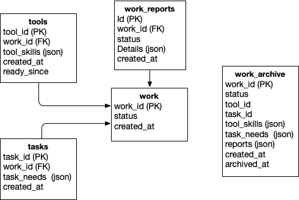

## Disclaimer

This is a personal exploratory project in progress, not production ready code.  

## Introduction

This project is a study in how processing tools and tasks could be managed by a restful micoservice running in a Docker container on behalf of clients that supply that tools and tasks to be managed.

The notion of the service is that tasks will be submitted to the service to be processed by external tools that are tracked by the service.  Tasks have "needs" that express how they are to be processed.  Tools have "skills" that specify what capabilities they have.  A task is matched to a tool for processing according to their respective needs and skills.  A "work" item is created linking the compatible task and tool.  Idle tools periodically check to see if they have been assigned work and, if so, begin processing it.  The tool will issue progress "reports" to the work item and eventually send a completion report (succeeded or failed).  At this point, all of the information from the work item, including the reports it received, will be copied to a work "archive" and the work item deleted.  If the work was successful, the task will also be deleted.

The service is agnostic of internal details of tool skills and task needs save that they must be valid json.  The actual tool/task assignment is performed by a client-provided assigner that will periodically query the api to get a list of available tasks and tools to consider for assignment.

An example use case would be a laboratory where multiple instruments periodically collected data that needed to be processed (task) by an appropriate program (tool).  Instruments and their data processing needs would not all be the same.  The service does not at this time provide a mechanism for stringing multiple tools together into processing pipelines.  That capability could be implemented in application-specific client software.

## Description

The service is written in python and uses the fastapi library to provide the restful micoservice. It uses  a postgresql database to store its internal state.  The SqlModel library is used to provide an ORMl for the database.  The service container packages the microservice api code, a postgresql database, and a pgadmin instance (as a convenience).

### Database

The database has a simple schema as show below:

The "tools" table is a list of all tools that are currently active or available.  The "tasks" table is a list of all the tasks that are active or available.  The "work" table records the assignement of task and tool.  The "work_reports" table records the progress reports sent by the tool the work item that it is currently assinged to.  The "work_archive" table records the complete record of a completed work item.